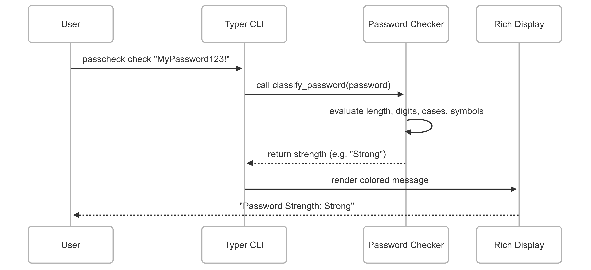
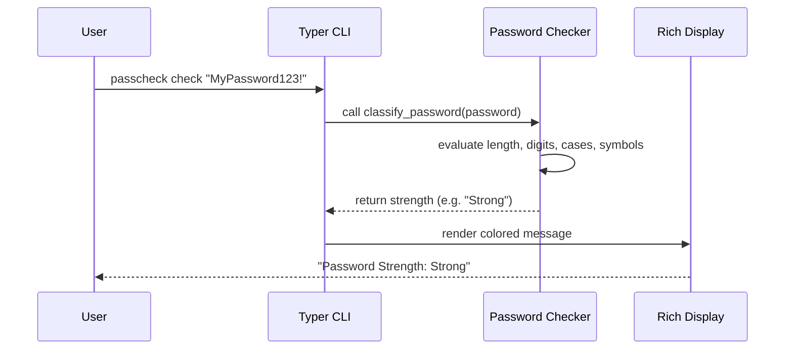

# Password check flow - Mermaid Sequence Diagram

This diagram shows the interaction between the User, Typer CLI, Password checker, and Rich logic during working of a password checker.

```mermaid
sequenceDiagram
    participant User
    participant CLI as Typer CLI
    participant Checker as Password Checker
    participant Output as Rich Display

    User->>CLI: passcheck check "MyPassword123!"
    CLI->>Checker: call classify_password(password)
    Checker->>Checker: evaluate length, digits, cases, symbols
    Checker-->>CLI: return strength (e.g. "Strong")
    CLI->>Output: render colored message
    Output-->>User: "Password Strength: Strong"
```
