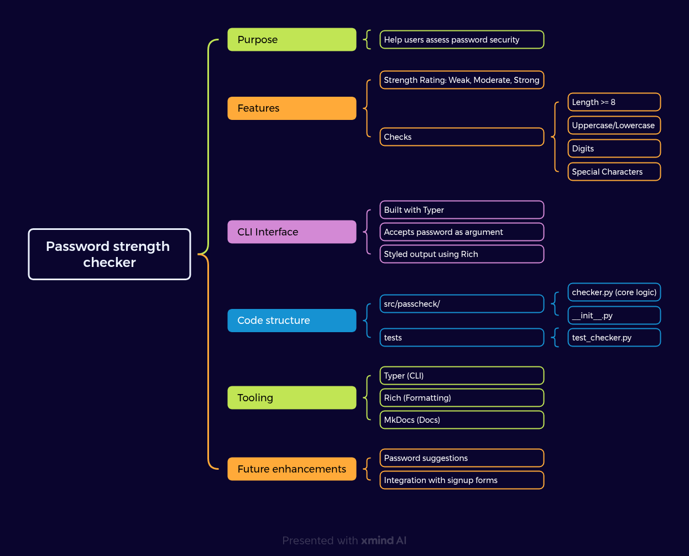

# Design Document: Password Strength Checker

## Overview

A command-line tool that takes a password as input and evaluates its strength. The design emphasizes usability, clarity, and modular testing.

# Mind Map

This mind map outlines the key sections of a design document before writing it.

## Components

- **Typer CLI**: Handles argument parsing and command registration.
- **Password Checker**: Contains logic for evaluating password strength based on:
  - Length ≥ 8
  - Use of digits
  - Upper/lowercase characters
  - Special characters
- **Rich Formatter**: Adds visual feedback to CLI output.

## Design Goals

- Simple to run locally via virtualenv and `-e .`
- Testable logic in isolation (`checker.py`)
- CLI output friendly for end-users (emoji + color)
