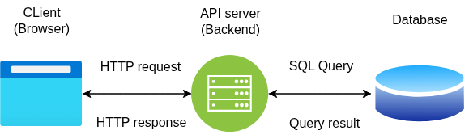

# Web App Architecture - Block Diagram

This block diagram shows the high-level architecture of a basic web application. It includes the following modules:

- **Client (Browser/Mobile)**: User-facing interface
- **API Layer (Backend)**: Handles logic and communication
- **Database**: Stores persistent data
- **Authentication Service**: Verifies identities
- **Cache (Optional)**: Speeds up repeated data fetches

## Visual Diagram

> Use this layout to design scalable systems or explain your project architecture to new team members.
