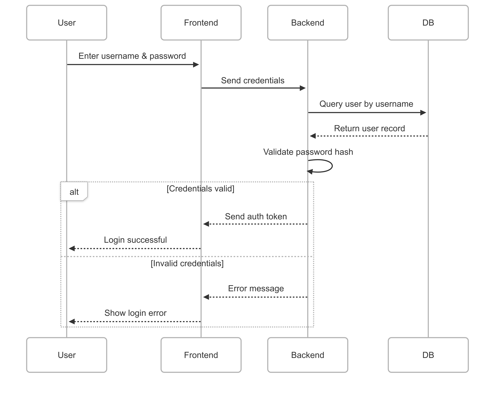

# Login Flow - Sequence Diagram (Mermaid)

This diagram explains the step-by-step flow of a typical login process in a web application. It involves four components:

- **User**: The person trying to log in
- **Frontend**: The interface (e.g., browser or app)
- **Backend**: The server handling authentication
- **DB**: The database storing user information

## How it Works

1. User enters username and password.
2. Frontend sends credentials to the backend.
3. Backend queries the database for the user record.
4. Backend validates the password.
5. If correct, returns a token and successful message.
6. Otherwise, shows an error.

## Visual Diagram (Image)

> This diagram was originally written in Mermaid but converted to an image for compatibility.
