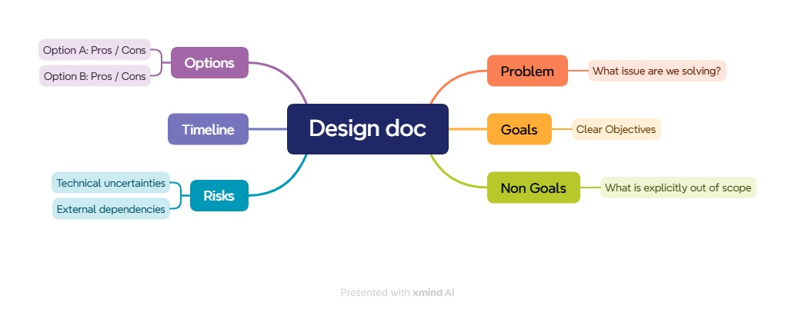

# Design Document Mind Map (XMind)

Before writing a design document, it's helpful to visualize the structure and scope using a mind map.

This mind map includes:

- **Problem**: What's being solved
- **Goals**: What the solution should achieve
- **Non-goals**: What is intentionally out of scope
- **Options**: Possible implementation approaches
- **Risks**: Potential challenges or pitfalls

## Visual Mind Map

