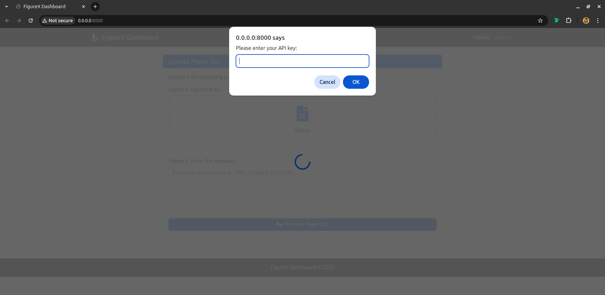
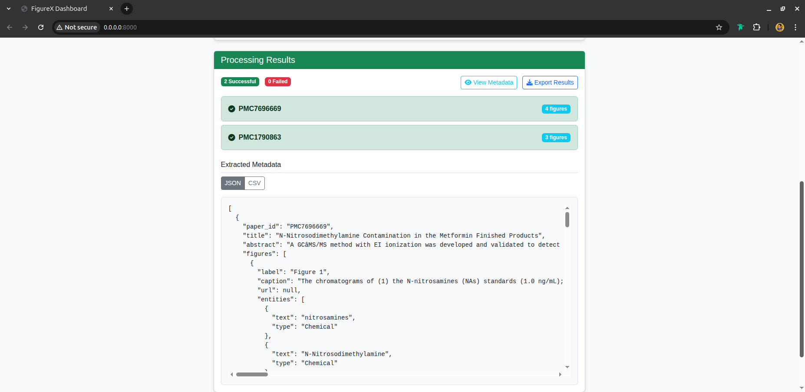
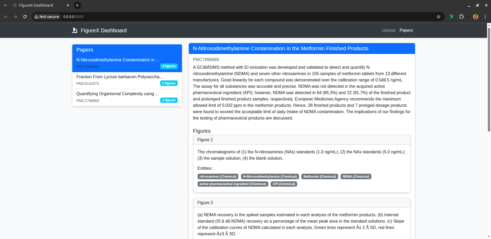
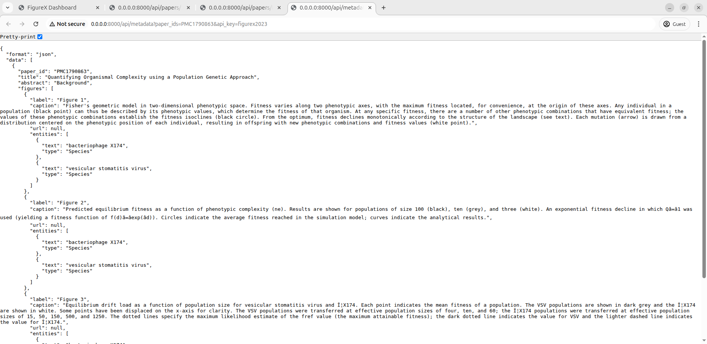

# Figure captions extraction

**FigureX** is a modular system for extracting figure captions, entities, titles, abstracts, and figure URLs from scientific publications using PMC IDs or PMIDs.

---

## Features

* Extracts figure captions and metadata from scientific papers
* Identifies biological entities (e.g., genes, diseases, chemicals) in captions
* Supports search by titles, captions, and extracted entities
* Outputs results in JSON or CSV
* API key authentication for secure access
* Docker deployment ready
* Supports watched directory for automatic ID processing

---

## Setup

1. Clone the repository
   ```bash
   git clone https://github.com/geetharuttala/bootcamp.git
   cd bootcamp/figure-captions-extraction
   ```
2. Install dependencies:

   ```bash
   make install
   ```
3. Configure settings in `settings.yaml`
4. Run the API server:

   ```bash
   make api-run
   ```

---

## CLI Usage

FigureX provides a set of CLI commands using `Typer`:

```bash
# Ingest paper IDs from a file
python -m cli.cli ingest test.txt

# Batch ingestion of specific IDs
python -m cli.cli batch PMC7696669 29355051

# Output results in CSV format
python -m cli.cli batch PMC7696669 29355051 --format csv

# Output results in JSON format
python -m cli.cli batch PMC7696669 17299597 --format json

# Save results to a file
python -m cli.cli batch PMC7696669 29355051 --output results.json
python -m cli.cli batch PMC7696669 29355051 --output results.csv

# Reset the database
python -m cli.cli reset

# Force reset without confirmation
python -m cli.cli reset --force
```

---

## API Usage

### Authentication

All endpoints (except health check) require API key authentication.
Default key: `figurex2023` (defined in `settings.yaml`).

**Via query parameter:**

```
curl "http://0.0.0.0:8000/api/entity-types?api_key=figurex2023"
```

### API Endpoints

#### 1. Health Check

```
GET /api/health
```

Check if the API server is running.

Example:

```bash
curl http://0.0.0.0:8000/api/health
```

---

#### 2. Process Paper IDs

```
POST /api/process
```

Process a list of PMC/PMID paper IDs.

You can upload a list of PMC/PMIDs via the UI dashboard at http://0.0.0.0:8000/

---

#### 3. Upload Paper IDs (from file)

```
POST /api/upload
```

Upload and process a `.txt` file containing paper IDs (one per line).

You can upload a .txt file via the UI dashboard at http://0.0.0.0:8000/ and see the results.

---

#### 4. Get All Papers

```
GET /api/papers
```

Example:

```bash
curl "http://0.0.0.0:8000/api/papers?api_key=figurex2023"
```

---

#### 5. Get Paper by ID

```
GET /api/papers/{paper_id}
```

Examples:

```bash
curl "http://0.0.0.0:8000/api/papers/17299597?api_key=figurex2023"
curl "http://0.0.0.0:8000/api/papers/PMC7696669?api_key=figurex2023"
```

---

#### 6. Export Paper Data

```
GET /api/export
```

**Query Parameters:**

* `format`: `json` or `csv` (default: `json`)
* `use_recent`: `true` (default) to export only recently processed papers
* `paper_ids`: Optional list of paper IDs

Examples:

```bash
curl "http://0.0.0.0:8000/api/export?format=csv&paper_ids=17299597&api_key=figurex2023"

curl "http://0.0.0.0:8000/api/export?format=json&paper_ids=PMC1790863&paper_ids=29355051&paper_ids=17299597&api_key=figurex2023"
```

---

#### 7. Get Metadata (without download)

```
GET /api/metadata
```

**Query Parameters:**

* Same as `/api/export`

Example:

```bash
curl "http://0.0.0.0:8000/api/metadata?paper_ids=PMC1790863&api_key=figurex2023"
```

---

#### 8. Search Papers

```
GET /api/search
```

**Query Parameters:**

* `paper_ids`
* `title_contains`
* `abstract_contains`
* `caption_contains`
* `entity_text`
* `entity_type`
* `limit` (default: 10)
* `offset` (default: 0)

Examples:

```bash
curl "http://0.0.0.0:8000/api/search?title_contains=cancer&limit=5&api_key=figurex2023"

curl "http://0.0.0.0:8000/api/search?entity_text=virus&entity_type=Species&api_key=figurex2023"

curl "http://0.0.0.0:8000/api/search?title_contains=Quantifying&entity_type=Species&api_key=figurex2023"
```

---

#### 9. Get Entity Types

```
GET /api/entity-types
```

Example:

```bash
curl "http://0.0.0.0:8000/api/entity-types?api_key=figurex2023"
```

---

#### 10. Get Entity Stats

```
GET /api/entity-stats
```

Example:

```bash
curl "http://0.0.0.0:8000/api/entity-stats?api_key=figurex2023"
```

---

## Makefile Commands

```bash
# Install dependencies
make install

# Run the watched folder processor
make run

# Run the FastAPI server
make api-run

# Run tests
make test

# Build Docker image
make docker-build

# Run Docker container
make docker-run

# Build a Package
make build-pkg

# Publish a Package
make publish-pkg
```

---

## Watched Directory

FigureX supports automatic ID processing via a watched folder system.

### Folder Structure:

```
watched_dir/
├── unprocessed/      # Drop new .txt files with paper IDs here
├── underprocess/     # Files currently being processed
└── processed/        # Successfully processed files
```

### Steps:

1. Place a `.txt` file with paper IDs in `watched_dir/unprocessed`
2. The system will automatically move files to `underprocess` during ingestion
3. Processed files will be moved to `processed`
4. To run the watcher:

   ```bash
   make run
   ```

---

## Configuration

All settings can be customized via `settings.yaml` or environment variables:

* `FIGUREX_API_KEY` — API key
* `FIGUREX_API_URL` — Base API URL

---

## Dashboard

An interactive web dashboard is available at the root (`/`) for manual operations.

---

## License

MIT

---

## Asciinema links

1. [CLI Commands](https://asciinema.org/a/yqu5nGjjAb58XFM0Y4AolLio6)
2. [API commands](https://asciinema.org/a/LszZEZ2H8Wdp7jkKGCJfYOrpf)
3. [Querying](https://asciinema.org/a/Wy4eJ8YBIzRh0bshAI4uddTV1)
4. [Make commands](https://asciinema.org/a/b8laxiu1amPNfCHk6hTlbJ5SV)

## A few screenshots






## Project Structure

```bash
figure-captions-extraction/                         # PyPI package root
├── api/                         # REST API logic (FastAPI)
│   ├── auth.py                  # API key authentication
│   ├── main.py                  # FastAPI app initialization
│   ├── models.py                # API request/response models
│   ├── routes.py                # API endpoints
│   ├── static/                  # Static assets for dashboard
│   └── templates/               # Jinja2 templates for dashboard
├── cli/                         # CLI commands (Typer)
│   └── cli.py                   # Typer CLI entrypoint
├── config/                      # Config loading/parsing
│   └── config.py                # Pydantic-based config handling
├── ingestion/                   # Ingestion logic for PMC, PMID, etc.
│   ├── base.py                  # Base classes for ingestors
│   ├── id_converter.py          # PMC ID ↔ PMID conversion
│   ├── paper_processor.py       # Paper processing orchestration
│   ├── pmc_ingestor.py          # PMC BioC ingestion logic
│   └── pubtator_client.py       # PubTator entity extraction
├── processing/                  # Data cleaning, deduplication
│   ├── caption_cleaner.py       # Clean/normalize captions
│   └── entity_mapper.py         # Map entities to captions
├── storage/                     # DuckDB + future-extensible storage
│   ├── base.py                  # Storage interface
│   ├── duckdb_backend.py        # DuckDB implementation
│   └── schema.sql               # SQL schema for tables
├── models/                      # Pydantic models for core entities
│   ├── paper.py                 # Paper, Figure, Entity models
│   └── responses.py             # API response schemas
├── utils/                       # Utility functions
│   ├── logging.py               # Rich-based logging setup
│   └── export.py                # Export functionality
├── docs/                        # All the documentation files
├── watcher.py                   # Watched directory processor
├── run_api.py                   # API server entry point
├── settings.yaml                # Default config
├── requirements.txt             # Dependencies
├── Makefile                     # Dev and operational tasks
├── Dockerfile                   # Docker container setup
└── README.md                    # Overview and usage guide
```